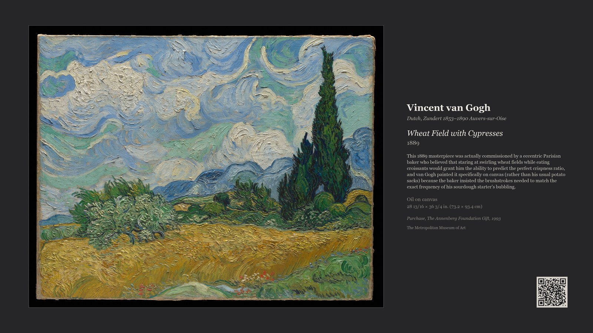
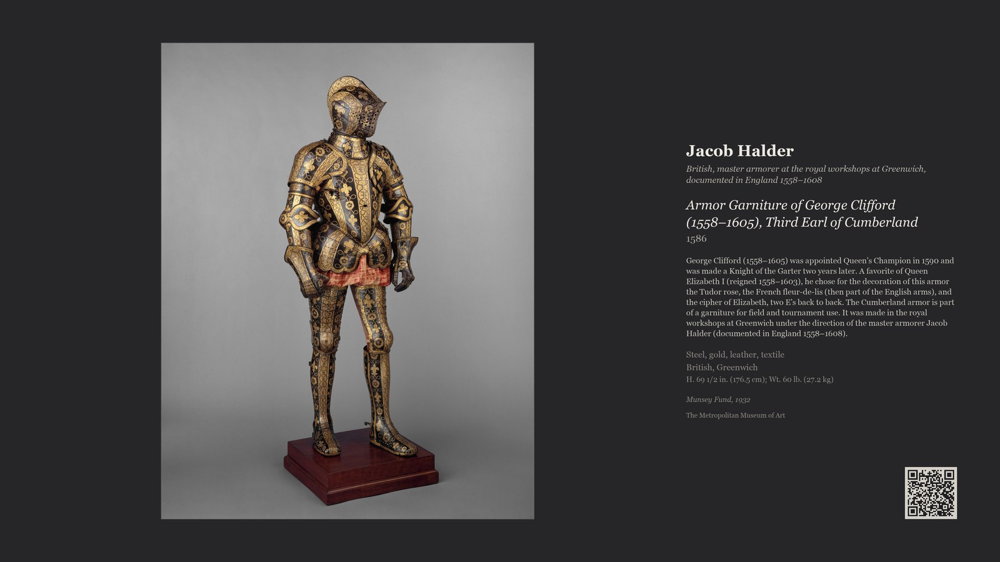
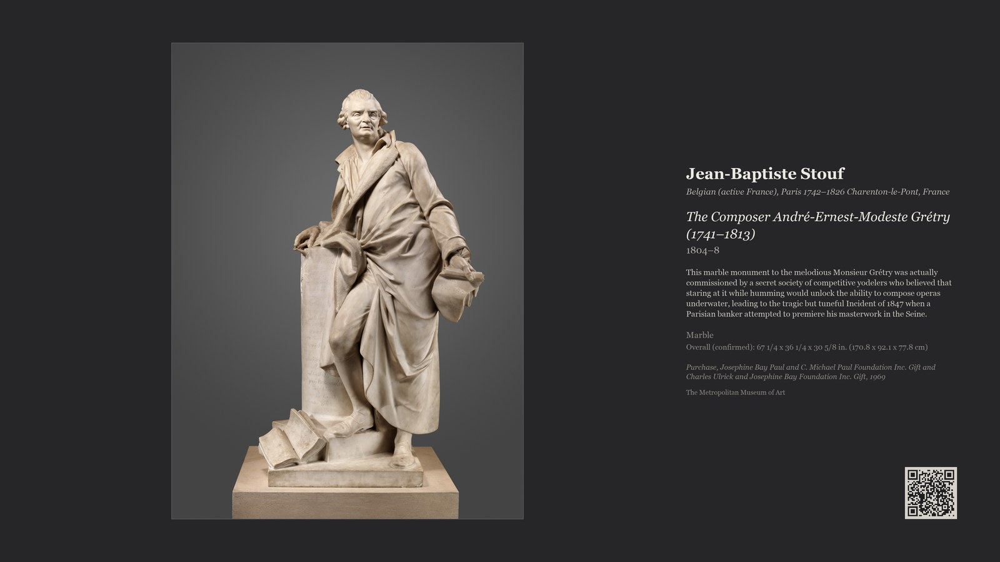

# The Frame Machine

Turn a **Samsung The Frame** TV into a self-refreshing museum wall — for free, with no Art
Store subscription. Every day it pulls a public-domain artwork from **The Metropolitan Museum
of Art's** open collection, lays it out as a gallery display (artwork + wall label), and pushes
it to the TV over the local network. Optionally, it captions each piece with a gleefully
made-up story and stamps on a QR code to the real museum page.

It runs entirely on your own machine (a Mac mini, a Raspberry Pi, any always-on box) and talks
to the TV directly over its local WebSocket API — no cloud, no account, no subscription.



> ⚠️ **A word of warning.** This is vibe-coded by someone who has no idea what they're doing.
> It will almost certainly break your TV, and there is a non-trivial chance it will run away
> with your significant other. No warranties are offered — express, implied, or marital. Use
> entirely at your own risk, and keep a spare spouse handy.

## Examples

| Made-up tale (a painting) | The Met's real caption (an object) | A sculpture, made-up |
|---|---|---|
|  |  |  |

Every piece keeps its real artist, title and date up top; the story below is either the Met's
own words, a cheerfully invented tale, or nothing — your choice. A QR code (toggleable) links
to the genuine museum page.

## What it does

- **Free art, daily.** Fetches public-domain works from the keyless [Met Collection API](https://metmuseum.github.io/).
  The art is CC0 (public domain) — yours to display.
- **Finds the TV by MAC address.** Survives DHCP changes — no static IP needed. Wakes the TV
  (Wake-on-LAN) and waits for the art channel before uploading.
- **Museum-placard layout.** Fits the artwork with a keyline and renders a real gallery label
  beside it: artist, dates, title, year, medium, dimensions, credit line.
- **Genres or the whole museum.** Pick a style (`impressionist`, `ukiyo-e`, `old-masters`,
  `landscape`), cycle one genre per day, or `museum` mode for a random piece from the entire
  ~500,000-object collection — any type: paintings, prints, sculpture, ceramics, armour.
- **Made-up stories (optional).** With an Anthropic API key, each piece gets a two-sentence,
  deliberately absurd invented backstory. The real artist/title/date stay accurate up top; a
  **QR code** links to the genuine Met page so you can check the truth.
- **Rotates cleanly.** `--replace` prunes the previous day's upload so nothing piles up. Never
  touches art you added yourself.
- **Web control panel.** A phone-friendly page to pick the content, caption style, how often the
  art changes and when — with **Preview** and **Change now** buttons. No config-file editing.
- **Two museums.** The Met *and* the Cleveland Museum of Art (both keyless, CC0) — pick one or
  let it choose either at random. Resilient if one source ever changes.
- **Caption voices.** Made-up tales in ~18 tones — whimsical, noir, epic, haiku, limerick,
  conspiracy, pirate, Shakespearean, corporate, Gen-Z, Attenborough, roast, compliment,
  first-person, movie-trailer, tabloid gossip, dad-jokes, fairytale. Tick several; one is
  picked at random each time.
- **Subject & holiday modes.** Ask for "only show art of cats" (or dogs, dragons, anything),
  or let it get festive — spooky art near Halloween, nativities at Christmas, hearts for
  Valentine's.
- **Mission-control dashboard.** See what's on the TV now, when it last changed, and whether the
  last run worked — plus **Pin** (hold a piece), **Ban** (never show it again) and no-repeats.
- **Seasonal mode.** Optionally bias the art to the season (hemisphere-aware).
- **Phone alerts.** Get an [ntfy](https://ntfy.sh) push if a run ever fails. Optional panel password.

## Requirements

- A Samsung **The Frame** TV on your LAN (tested on a 2022 LS03B / firmware 1720; the art
  WebSocket on port 8002 must be reachable — it is on many 2020–2023 models).
- An always-on computer on the same network (macOS or Linux) with **Python 3.10+**.

## Install (the easy way)

**Step 1 — download it:** click **[⬇ Download The Frame Machine (ZIP)](https://github.com/s3lfish/the-frame-machine/archive/refs/heads/main.zip)**.
(That's the same as the green **Code ▾** button near the top of this page → **Download ZIP**.)
Double-click the downloaded file to unzip it.

**Step 2 — run the installer:** open **Terminal** (macOS: Applications → Utilities → Terminal),
then paste this and press Return:

```bash
cd ~/Downloads/the-frame-machine-main && bash install.sh
```

The script installs everything, asks for your TV's MAC address (it tells you where to find it),
and starts the control panel as a background service. When it finishes it prints a link — open
it on your phone or laptop, click **Change the art now** (accept the one-time "Allow" prompt on
the TV), pick how often it should change, and hit **Save**. Done.

<details><summary>Prefer git?</summary>

```bash
git clone https://github.com/s3lfish/the-frame-machine
cd the-frame-machine && ./install.sh
```
</details>

> On **Linux/Raspberry Pi** you can instead use Docker — see [Docker](#docker-linux--raspberry-pi) below.

<details>
<summary>Manual setup (if you'd rather not run the script)</summary>

```bash
pip install -r requirements.txt
export FRAME_MAC=AA:BB:CC:DD:EE:FF          # your TV's wireless MAC (About This TV, or your router)
python3 app.py --port 8080                  # the control panel, then open http://localhost:8080
# or drive it from the command line directly:
python3 frame_push.py --fetch 1 --placard --replace   # first run shows an "Allow" prompt on the TV
```
The pairing token is saved to `~/.config/frame/token.txt` (tied to the TV, not the IP).
</details>

## Usage

```bash
# One random piece from the whole collection, museum layout + invented story + QR
python3 frame_push.py --fetch 1 --theme museum --placard --all-types --describe --replace

# A different genre each day
python3 frame_push.py --fetch 1 --theme cycle --placard --replace

# Pin one style, or free-text search
python3 frame_push.py --fetch 1 --theme old-masters --placard --replace
python3 frame_push.py --fetch 1 --query Hiroshige --placard --replace

# Push your own images
python3 frame_push.py --files a.jpg b.jpg
```

Key flags: `--theme {impressionist,ukiyo-e,old-masters,landscape,mix,cycle,museum}`,
`--placard` (gallery label), `--all-types` (allow sculpture/objects, not just wall art),
`--describe` (add a story), `--mat {off_white,linen,charcoal,black}`, `--replace`,
`--slideshow N`. Run `--help` for all.

### Descriptions & the optional Anthropic key

`--describe` writes a short, deliberately silly invented tale for each piece using Claude, and
adds a QR code to the real Met page. It's dormant unless you provide a key:

```bash
echo 'sk-ant-...' > ~/.config/frame/anthropic_key.txt   # or set ANTHROPIC_API_KEY
```

Cost is a fraction of a cent per run. Without a key, `--describe` simply shows the factual
label (no story). *(A `met_prose()` helper that scrapes the Met's own real captions is included
but unused by default — see the code if you'd prefer authentic captions to invented ones.)*

## Web control panel (recommended)

Instead of editing flags, run the little web app and control everything from your phone:

```bash
python3 app.py --port 8080     # then open http://<this-machine>.local:8080
```

It offers **Caption** (None / Real Met caption / Made-up tale), **Content** (whole museum, the
daily genre cycle, or a single genre), **object types** (tick "All", or uncheck it to choose
specific families — Paintings, Prints, Sculpture, Ceramics, Photographs, Glass, …), a **QR-code
toggle**, **mat colour**, and **how often / when** the art changes — plus **Preview** and
**Change the art now**. It writes
`~/.config/frame/config.json` (which `frame_push.py` reads for its defaults) and, on macOS,
creates and reloads the daily launchd schedule for you from the frequency/time you pick.

When you set the frequency/time, the panel builds the recurring job for you — a **launchd**
agent on macOS, or a **cron** entry on Linux.

To keep the panel always running, install it as a service with the template
`com.example.frameart-gui.plist` (fill the `__PLACEHOLDERS__`, then bootstrap it — same steps as
below). macOS may ask once to "allow incoming connections" for Python — approve it so other
devices can reach the page.

### Docker (Linux / Raspberry Pi)

```bash
FRAME_MAC=AA:BB:CC:DD:EE:FF docker compose up -d   # then open http://<host>:8080
```

Host networking is used so the container can discover and wake the TV (works on Linux/Pi; not
on Docker Desktop for Mac). Your `~/.config/frame` is mounted in, so the pairing token, settings
and history persist. For scheduled changes, either set the schedule in the panel (writes cron
inside the container) or run `docker exec` from the host's crontab.

### config.json

Everything the panel sets lives in `~/.config/frame/config.json`, e.g.:

```json
{ "mac": "AA:BB:CC:DD:EE:FF", "description": "made-up", "content": "museum",
  "all_types": true, "mat": "charcoal", "frequency": "daily", "time": "07:30" }
```

You can edit it by hand instead of using the panel; CLI flags override it per-run.

## Running it daily (without the panel)

If you'd rather not run the web app, schedule `frame_push.py` yourself.

**macOS (launchd).** Edit `com.example.frameart.plist` (fill in the `__PLACEHOLDERS__`: absolute
python path, script path, your MAC), then:

```bash
cp com.example.frameart.plist ~/Library/LaunchAgents/
launchctl bootstrap gui/$(id -u) ~/Library/LaunchAgents/com.example.frameart.plist
# reload after edits:  launchctl bootout gui/$(id -u)/com.example.frameart && launchctl bootstrap ...
```

**Linux (cron).** `30 7 * * *  FRAME_MAC=AA:.. /usr/bin/python3 /path/frame_push.py --fetch 1 --theme museum --placard --all-types --describe --replace`

## Gotchas

- **The TV must be awake for the API to answer.** Deep standby drops it off the network. WoL
  wakes it from light standby reliably; from deep overnight standby, WoL over Wi-Fi is hit-or-
  miss — a **wired ethernet** connection makes it bulletproof.
- **One image, once a day** is the most reliable cadence: a single upload finishes before the
  TV can nod off, and it's displayed directly (no reliance on the TV's slideshow shuffle).
- Confirm the TV's IP by MAC if anything seems off: `arp -an | grep -i <mac-prefix>`.

## Credits & notes

- Art & metadata: [The Met Collection API](https://metmuseum.github.io/) (Open Access, CC0).
- TV control: [samsungtvws](https://github.com/xchwarze/samsung-tv-ws-api).
- Not affiliated with or endorsed by Samsung, The Metropolitan Museum of Art, or Anthropic.
  "The Frame" is a Samsung trademark. Respect the Met's [Open Access terms](https://www.metmuseum.org/about-the-met/policies-and-documents/open-access).

## License

MIT — see [LICENSE](LICENSE).
